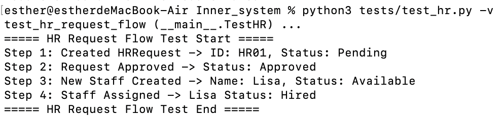
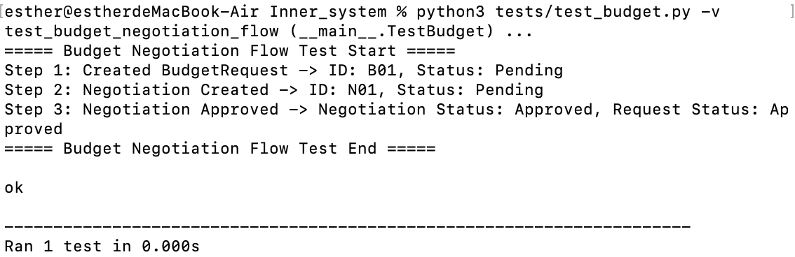
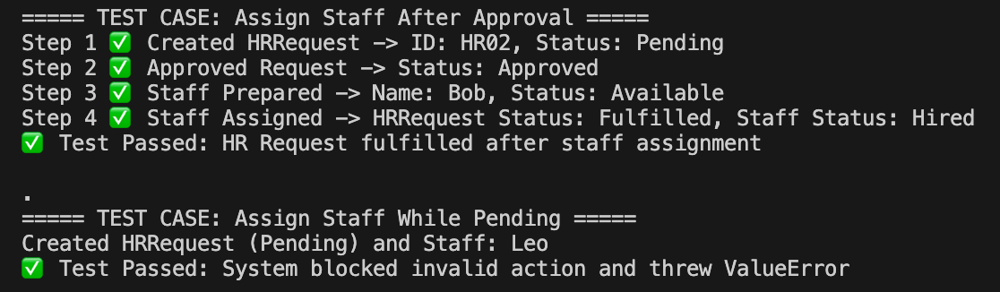
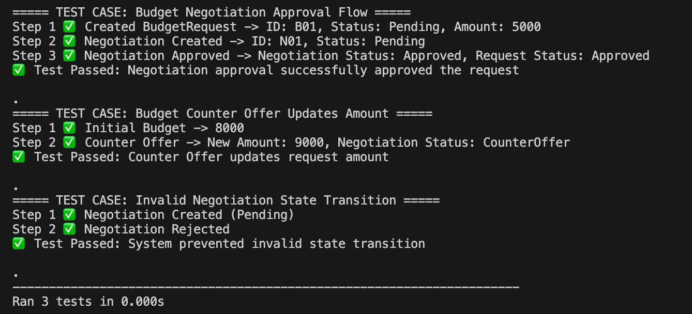
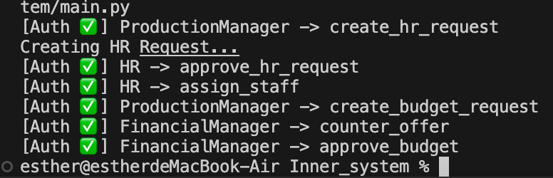
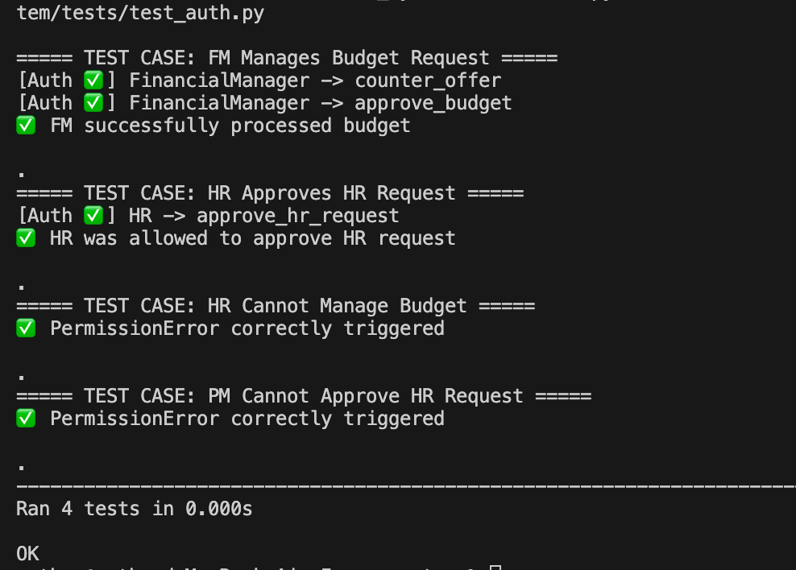
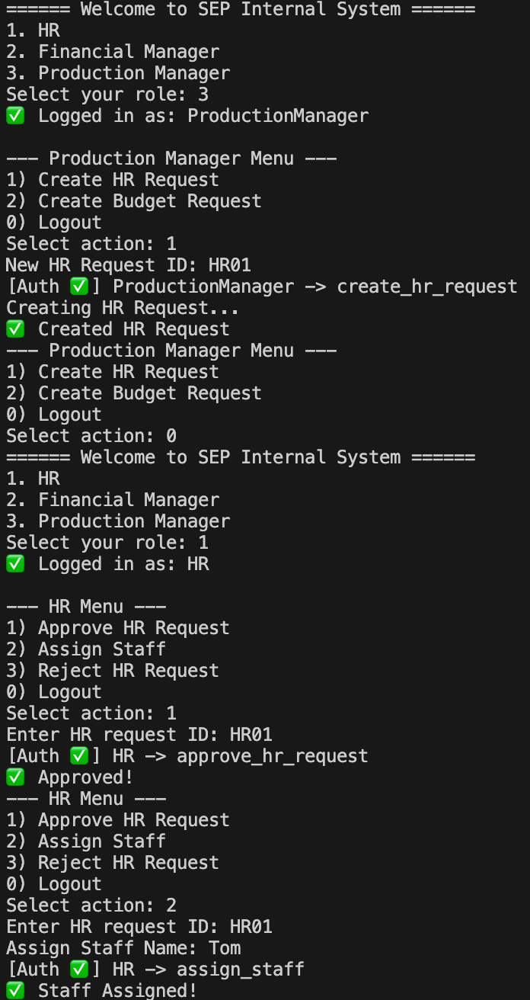
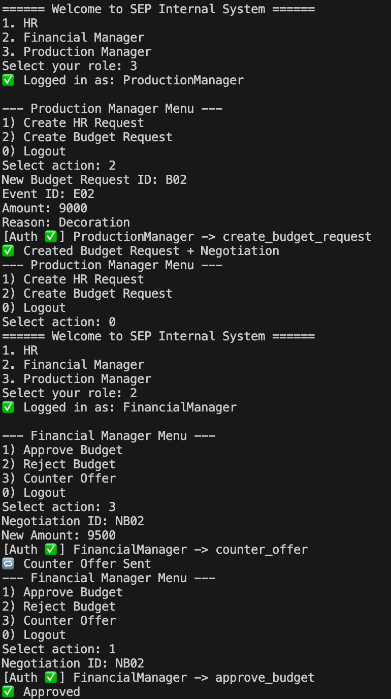

# Workflow 3: HR subsystem
## Environment
Python 3.9
`cd ~/Software_project/Inner_system/`
`python3 -m unittest discover -s tests -v`

## Structure
```ruby
Inner_system
├── app
│   ├── cli.py
│   ├── service.py
│   ├── auth.py
│   └── __init__.py
├── hr
│   ├── hr_request.py
│   ├── staff_member.py
│   └── __init__.py
├── budget
│   ├── budget_request.py
│   ├── negotiation.py
│   └── __init__.py
├── tests
│   ├── test_hr.py
│   ├── test_hr2.py
│   ├── test_budget.py
│   ├── test_budget2.py
│   ├── test_auth.py
│   └── __init__.py
├── main.py
├── README.md
└── __init__.py
```

## Iteration1
### 1. HRRequest
   Recruitment request processing and employee allocation (minimal implementation).
   

### 2. BudgetRequest
   Budget requests, budget negotiations and approvals (minimal implementation).
   

## Iteration2
The subsystem creates `tests/test_hr2.py` and `tests/test_budget2.py`.
### 1. HRRequest
**Add constraints and state transformation:**
   The recruitment request must be approved before recruitment can take place. 
   If a candidate is recruited, the request will automatically be marked as "Fulfilled".
    `Pending → Approved → Fulfilled`
    `Pending → Rejected`
    

### 2. BudgetRequest
**Negotiation states:**
After the budget negotiation is approved, the budget request is also approved. 
After the budget negotiation is approved, the budget request is also approved. 
The financial manager can make budget negotiations and update the amounts.
   

## Iteration3: 
### 1. Access control
The subsystem creates `app/auth.py`, `app/service` and `main.py` to implement access control, as well as `tests/test_auth.py` to test.
 


### 2. Login and roles
Add `app/cli.py`
Run `python3 -m app.cli`
#### Sample 1: HR request
1.  Log in with PM and create a request
    ```ruby
    Select your role: 3   (Production Manager)
    Create HR Request
    Select action: 1
    New HR Request ID: HR01
    ✅ Created HR Request
    ```
2. The HR manager processed the request through the login procedure.
   ```ruby
   Select your role: 1  (HR)
   1) Approve HR Request
   Enter HR request ID: HR01
   ✅ Approved!
   ```
3.  HR assigns employees (Fulfilled ✅)
    ```ruby
    2) Assign Staff
    Enter HR request ID: HR01
    Assign Staff Name: Tom
    ✅ Staff Assigned!
    ```


#### Sample 2: Budget negotiation
1. The PM logs in and creates a budget request.
   ```ruby
    Select your role: 3
    Select action: 2
    New Budget Request ID: B02
    Event ID: E02
    Amount: 9000
    Reason: Decoration
    ✅ Created Budget Request + Negotiation
   ```
   We have `BudgetRequest: B02` and `Negotiation: N B02`
2. FM logs in and conducts negotiations
   ```ruby
    Select action: 0
    Select your role: 2
    Select action: 3
    Negotiation ID: NB02
    New Amount: 9500
    🔁 Counter Offer Sent
   ```
   Amount: 9000 → 9500 ✅
3. FM finally approved (after negotiating with the client)
    ```ruby
    Select action: 1
    Negotiation ID: NB02
    ✅ Approved
    ```


## Acceptance Tests
### 1. HR Subsystem
- User Story: 
> As the Production Manager, I hope to initiate a recruitment request so that HR can allocate staff to meet the personnel demands of the employee guarantee activities.

- Actors: PM → HR
- Precondition: User logged into system
- Postcondition: HRRequest.Fulfilled or Rejected
- Steps：

| Step | Actor | Operation | Expected System Behavior |
|------|-------|-----------|------------------------|
| 1 | PM | Create HR Request HR01 | ✅ Created HR Request |
| 2 | HR | Approve HR01 | ✅ HR01 status = Approved |
| 3 | HR | Assign Staff Tom | ✅ HR01 status = Fulfilled |
| 4 | PM | Create HR Request HR02 | ✅ Created HR Request |
| 5 | HR | Reject HR02 | ✅ HR02 status = Rejected |

### 2. Budget Subsystem
- User Story: 
> As the Financial Manager, I hope to negotiate the activity budget and make the final decision to ensure that the budget is reasonable and in line with the organization's interests.

- Actors: PM → FM
- Precondition: BudgetRequest has been created
- Postcondition: BudgetRequest.Approved or Rejected
- Steps：

| Step | Actor | Operation | Expected System Behavior |
|------|-------|-----------|------------------------|
| 1 | PM | Create Budget Request B02 (9000kr) | ✅ Request created + NB02 created |
| 2 | FM | CounterOffer NB02 → 9500kr | ✅ Request amount updated |
| 3 | FM | Approve NB02 | ✅ B02 status = Approved |
| 4 | PM | Create Budget Request HR04 (10000kr) | ✅ Request created + NB04 created |
| 5 | FM | Reject NB04 | ✅ B04 status = Rejected |
