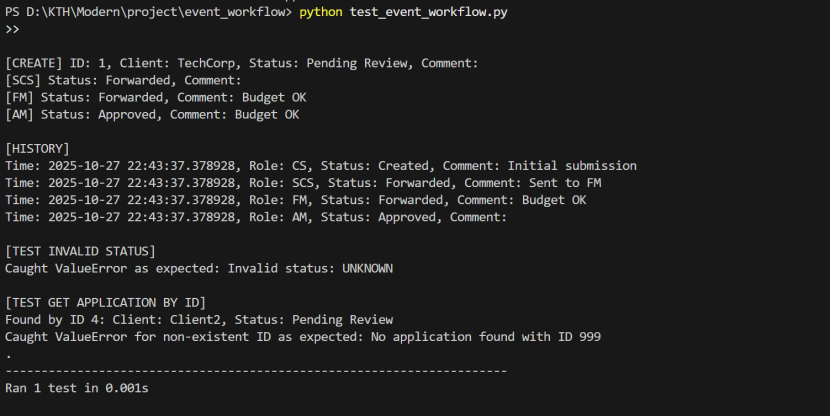
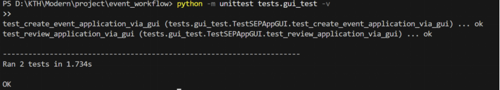
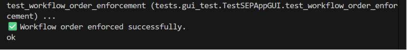
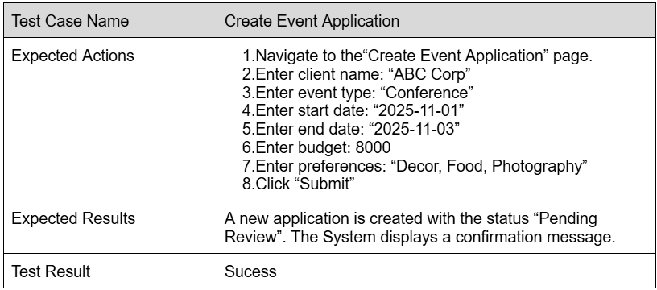
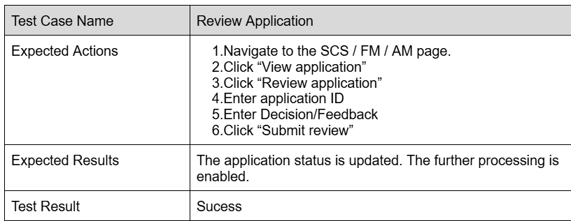

# Workflow 1 EventApplication
## Environment
Python 3.11.4 cd event_workflow python -m unittest discover -s tests -p "*.py" -v

## Structure    
event_workflow/     
├── app/    
│   └── event_workflow_gui.py   
│   └── __init__.py     
├── workflow/   
│   └── event_workflow.py   
│   └── __init__.py     
├── tests/  
│   ├── gui_test.py     
│   └── test_event_workflow.py      
│   └── __init__.py  
├── main.py     
└── README.md   

## Iteration1
Test the fucntion of creating application, history storation, invalid status and getting application by ID.

## Iteration2
Test create and review in GUI.

## Iteration 3
Test the workflow order for event application reviews

## Acceptance test
### Create event application    
·User Story     

    The Senior Customer Service officer can create a new event application by entering the client’s information. And the application is saved in the system with status Pending Review. 

### Review application
·User story     

    The SCS officer can review the application and decide whether to forward it to FM or reject it.
    The FM makes comments on the budget and forwards the application to the AM.
    The AM can decide whether to approve or reject the application based on the financial feedback and feasibility.

## The use of GUI   
 python app/event_workflow_gui.py execute GUI. The gui_test.py is used to test it.
